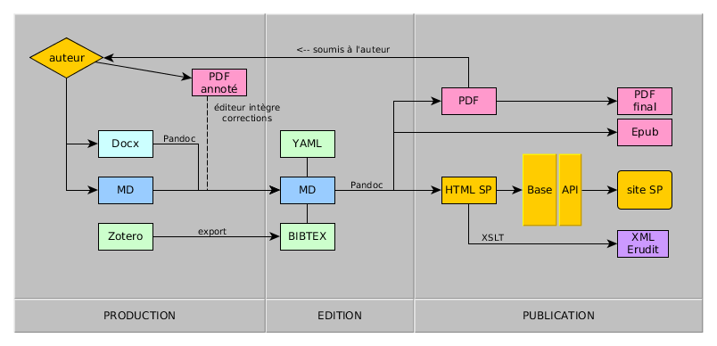

# chaineEditorialeSensPublic
Protocoles, templates et feuilles de style pour la chaîne de publication de la revue [Sens public](http://sens-public.org/).

La chaîne éditoriale se base sur un fichier pivot en markdown et une série de conversions faites avec [pandoc](http://pandoc.org) et des feuilles de style.

La chaîne peut être décrite de la manière suivante:

1. Document de l'auteur (en otd, docx ou md)
2. Document de travail avec l'auteur (en odt, docx ou md)
3. Document après révisions (en md)
  - validation de l'auteur (pdf via conversion pandoc)
4. Version html (pour publication sur le site de Sens public, cf le protocol) via conversion pandoc
5. Version xml eruditschema via conversion xslt
6. Version pdf via conversion pandoc

Dans ce repository sont déposés:

- le template html pour la conversion md2html : templateHtmlDcV0.html5
- le template tex pour la conversion md2pdf : templateLaTeX.latex
- la feuille de style xslt pour la conversion html2eruditschema : HTML2eruditV0.xsl
- le protocole éditorial de Sens public
- le yaml utilisé pour les articles avec l'ensemble des métadonnées : yamlSP.md

## Conversions

## Docx2md

    pandoc -f docx -t markdown --extract-media=./ --atx-headers SPXXXX.docx -o SPXXXX.docx.md

## Md2html

    pandoc --standalone --template=templateHtmlDcV0.html5 --ascii --filter pandoc-citeproc -f markdown -t html SPXXXX.docx.md -o SPXXXX.docx.md.html

## Md2tex

    pandoc --standalone --template=templateLaTeX.latex -f markdown -t latex SPXXXX.docx.md -o SPXXXX.docx.md.tex

## tex2pdf

    pdflatex SPXXXX.docx.md.tex

(2 fois)

## html2erudit
- xslt : HTML2eruditV0.xsl

